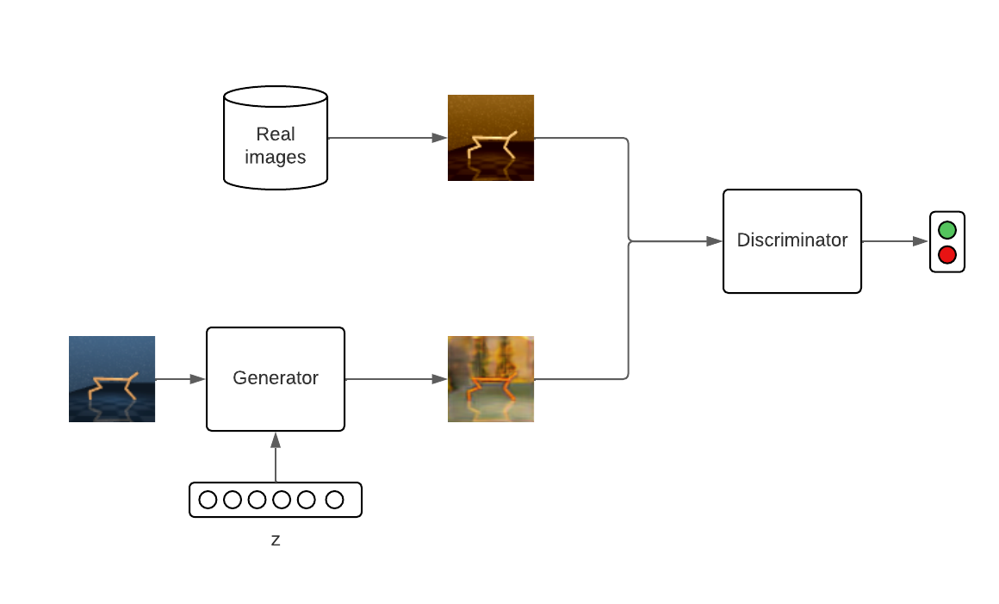

# Data Augmentation GAN

This implementation is based on [amurthy1/dagan_torch](https://github.com/amurthy1/dagan_torch) which is a PyTorch implementation for the paper [Data Augmentation Generative Adversarial Networks](https://arxiv.org/abs/1711.04340).

The architecture is changed to consider one class instead of multiple classes. This simplfies the overall architecture.

<p align="center">
  
</p>

## Start training

### Dataset
The dataset is assumed to be stored in [npz](https://numpy.org/doc/stable/reference/generated/numpy.savez.html) format with the following keys:
- `orig`: numpy array holding all original images
- `aug`: numpy array holding all corresponding augmentation images

The names of the dataset used in the implementation are:
- `train.npz`
- `val.npz`

### Train
You can use this example command as reference to start the training. For more information on the arguments look into `./utils/parser.py`.
```
python train_dagan.py ../../data/cheetah/dagan/ ../final_models/dagan/ --name dagan_model --use_wandb
```
