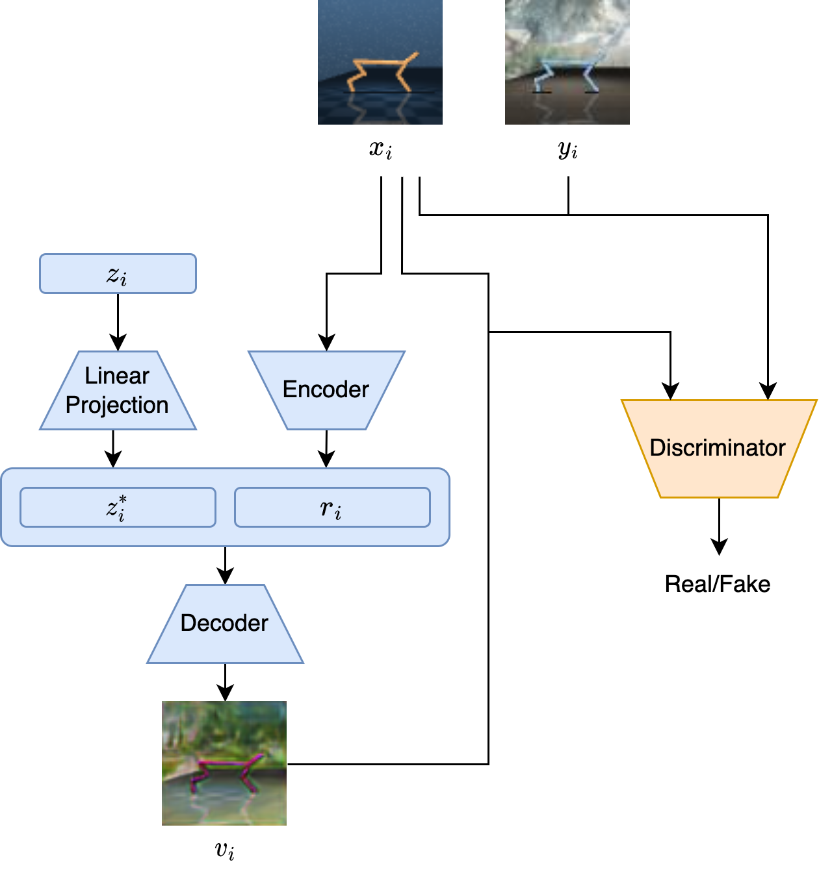

# Data Augmentation GAN

This implementation is based on [amurthy1/dagan_torch](https://github.com/amurthy1/dagan_torch) which is a PyTorch implementation for the paper [Data Augmentation Generative Adversarial Networks](https://arxiv.org/abs/1711.04340).

The architecture is changed to consider one class instead of multiple classes. This simplfies the overall architecture. The following image is a slightly modified version of the original DAGAN architecture (see [paper](https://arxiv.org/abs/1711.04340)):

<p align="center">
  
</p>

# Start Training

## Dataset
The dataset is assumed to be stored in [npz](https://numpy.org/doc/stable/reference/generated/numpy.savez.html) format with the following keys:
- `orig`: numpy array holding all original images
- `aug`: numpy array holding all corresponding augmentation images

The names of the dataset used in the implementation are:
- `train.npz`
- `val.npz`

## Train

1. Create virtual environment
  ```
  conda create -n my_env python=3.8
  ```
2. Install the dependencies in `requirements.txt`
  ```
  pip install -r requirements.txt
  ```
3. Install DAGAN package
  ```
  pip install -e .
  ```
4. Run train script (for more configuration options, see `.utils/parser.py`)
  ```
  python train.py PATH_TO_DATASETS --model_path PATH_TO_STORE_MODELS -n NAME_OF_WANDB_RUN_AND_MODELS_DIR
  ```

## Iterative Train (important: script uses newer syntax and requires python version 3.10)

1. Create virtual environment
  ```
  conda create -n my_env python=3.10
  ```
2. Install the dependencies in `requirements.txt`
  ```
  pip install -r requirements.txt
  ```
3. Install DAGAN package
  ```
  pip install -e .
  ```
4. Install (dcm_remastered)[https://github.com/QData/dmc_remastered]
  ```
  git clone https://github.com/QData/dmc_remastered.git
  cd dmc_remastered
  pip install -e .
  ```
4. Run iterative train script (for more configuration options, see `.utils/parser.py`)
  ```
  xvfb-run -a -s "-screen 0 1024x768x24" python iterative_train.py PATH_TO_DATASETS --model_path PATH_TO_STORE_MODELS -n NAME_OF_WANDB_RUN_AND_MODELS_DIR --domain ENV_DOMAIN --taks ENV_TASK
  ```
  - The domain and task of environment should correspond to the ones used for creating the pre-training dataset.

## Troubleshooting

If you get the following error due to the `dmc_remastered` package:
```
TypeError: from_xml_string(): incompatible function arguments. The following argument types are supported:
    1. (xml: str, assets: Optional[Dict[str, bytes]] = None) -> mujoco._structs.MjModel
```

Go to the directory where your virtual environment is stored and edit the wrapper file e.g. `miniconda3/envs/my_env/lib/python3.10/site-packages/dm_control/mujoco/wrapper/core.py` from 
```
if xml_string is not None:
    ptr = mujoco.MjModel.from_xml_string(xml_string, assets)
else:
    ptr = mujoco.MjModel.from_xml_path(xml_path, assets or {})
```

to 

```
if xml_string is not None:
    for key in assets:
        if type(assets[key]) is not bytes:
            assets[key] = bytes(assets[key], encoding='utf8')
    ptr = mujoco.MjModel.from_xml_string(xml_string, assets)
else:
    ptr = mujoco.MjModel.from_xml_path(xml_path, assets or {})
```
